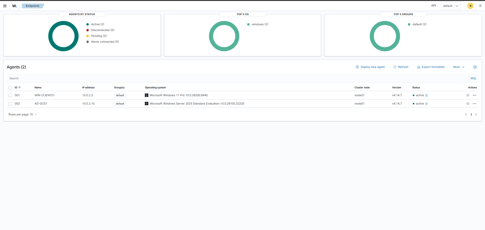
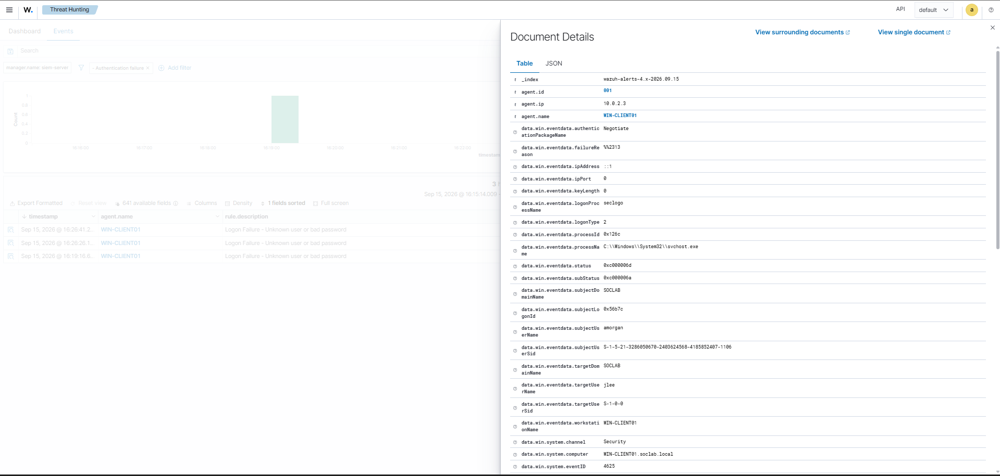
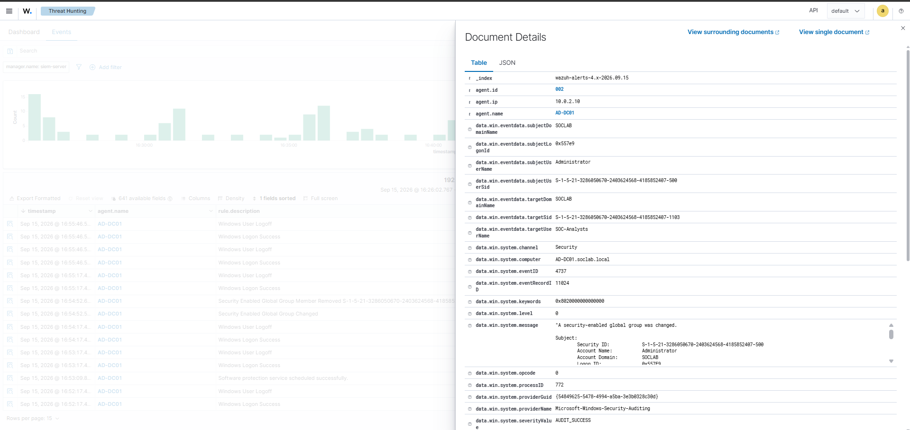

# Active Directory SOC Lab

A home cybersecurity lab simulating a small enterprise Windows environment with Active Directory and centralised security monitoring using Wazuh.

## Project Overview

This project was built to gain practical experience with:

- Active Directory and Windows domain administration
- Windows and Linux server configuration
- Networking and DNS
- SIEM deployment and endpoint monitoring
- Windows Security event analysis
- Security troubleshooting and threat investigation

## Architecture

```text
              soclab.local
                   │
          ┌────────┴────────┐
          │                 │
      AD-DC01         WIN-CLIENT01
 Windows Server 2025    Windows 11
  Domain Controller     Workstation
     + DNS                 │
          │                │
          └──── Wazuh Agents ────┐
                                 │
                                 ▼
                           Ubuntu SIEM
                            10.0.2.20
                                 │
                    ┌────────────┼────────────┐
                    │            │            │
                 Manager      Indexer      Dashboard
```

## Systems

| System | Purpose | IP |
|---|---|---|
| `AD-DC01` | Domain Controller + DNS | `10.0.2.10` |
| `WIN-CLIENT01` | Domain-joined Windows workstation | DHCP |
| `siem-server` | Wazuh SIEM | `10.0.2.20` |

All systems operate within a VirtualBox NAT Network.

## Active Directory

A Windows Server 2025 Domain Controller was configured for:

```text
soclab.local
└── SOC-Lab
    ├── Users
    ├── Groups
    └── Workstations
```

The environment includes lab users, a `SOC-Analysts` security group and a Windows 11 workstation joined to the domain.

## Wazuh SIEM

Wazuh 4.14 was deployed on Ubuntu Server 24.04 LTS.

Wazuh agents were installed on:

- `AD-DC01`
- `WIN-CLIENT01`

Both endpoints successfully reported security telemetry to the central Wazuh deployment.



## Detection Validation

Two controlled tests were performed to verify the monitoring pipeline.

### Failed Authentication

A failed domain authentication on `WIN-CLIENT01` generated Windows Security Event ID **4625** and was detected by Wazuh.



### Active Directory Group Change

A controlled modification to the `SOC-Analysts` security group on `AD-DC01` generated a security event that was collected and investigated through Wazuh.



These tests demonstrated the workflow:

```text
Endpoint Activity
      ↓
Windows Security Event
      ↓
Wazuh Agent
      ↓
Wazuh Manager
      ↓
Detection & Investigation
```

## Troubleshooting

During the build I troubleshot several issues, including:

- VirtualBox networking and incorrect gateway configuration
- Active Directory DNS forwarding
- Ubuntu static networking
- Windows agent installation
- Wazuh Dashboard installation
- Missing Dashboard TLS certificates
- Dashboard-to-Manager API authentication

These issues were diagnosed by isolating components, checking service status and logs, applying targeted fixes and verifying functionality.

## Documentation

Detailed setup documentation:

- [Ubuntu SIEM Setup](setup/ubuntu-siem.md)
- [Active Directory Setup](setup/active-directory.md)
- [Windows 11 Domain Workstation Setup](setup/windows-client.md)
- [Wazuh SIEM Deployment](setup/wazuh.md)

Supporting evidence is available in the [`screenshots`](screenshots/) directory.

## Project Status

**Version 1 Complete**

The lab successfully demonstrates a small Active Directory environment with centralised endpoint monitoring, security-event collection and controlled detection validation using Wazuh.

## Security

This repository contains only lab information. No real credentials, private keys or sensitive personal data are included.
