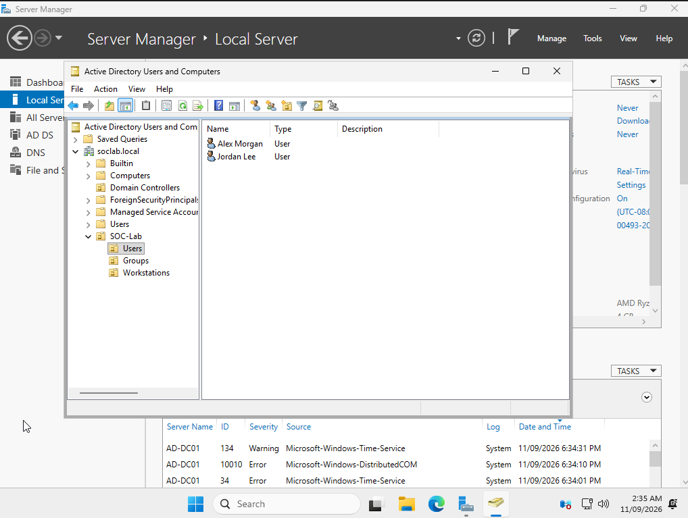
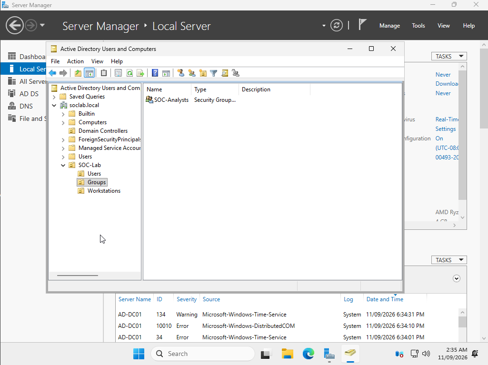

# Active Directory Setup

## Overview

A Windows Server 2025 virtual machine was configured as the domain controller for the lab.

The server was configured with the hostname `AD-DC01` and promoted to a domain controller for a new Active Directory forest.

## Domain Configuration

- Server: `AD-DC01`
- Domain: `soclab.local`
- NetBIOS domain name: `SOCLAB`
- Static IPv4 address: `10.0.2.10`
- Active Directory Domain Services (AD DS): Installed
- DNS Server: Installed
- Global Catalog: Enabled

## Organisational Structure

A top-level organisational unit named `SOC-Lab` was created to organise the lab's Active Directory objects.

Three child OUs were created:

- `Users`
- `Groups`
- `Workstations`

This separates user accounts, security groups, and domain-joined workstations and provides a structure that can later be used for Group Policy and security configuration.

## Test Users

Two fictional domain accounts were created for generating and analysing authentication activity later in the project:

- `amorgan` — Alex Morgan
- `jlee` — Jordan Lee

These accounts will later be used on domain-joined Windows systems to generate security events for SIEM monitoring and investigation.

## Security Groups

A Global Security group named `SOC-Analysts` was created.

The `amorgan` account was added as a member of `SOC-Analysts`, while `jlee` was left as a standard test user.

## Purpose

This Active Directory environment provides an identity and authentication source for the SOC lab.

A Windows workstation will later be joined to `soclab.local`. Activity generated by domain users will produce Windows security events that can be collected and analysed by the SIEM.
