# Windows Server & Active Directory Setup

## Overview

A Windows Server 2025 virtual machine was deployed to provide Active Directory Domain Services (AD DS) for the SOC lab.

The server was configured as `AD-DC01` and promoted to the first domain controller of a new Active Directory forest named `soclab.local`.

This environment will provide centralised identity and authentication for Windows endpoints whose security events will later be monitored by the SIEM.

---

## 1. Windows Server Virtual Machine

A Windows Server virtual machine named `AD-DC01` was created in Oracle VirtualBox.

### VM Configuration

- Operating System: Windows Server 2025 Standard Evaluation
- Memory: 4096 MB
- Processors: 2
- Storage: 50 GB
- Network: NAT

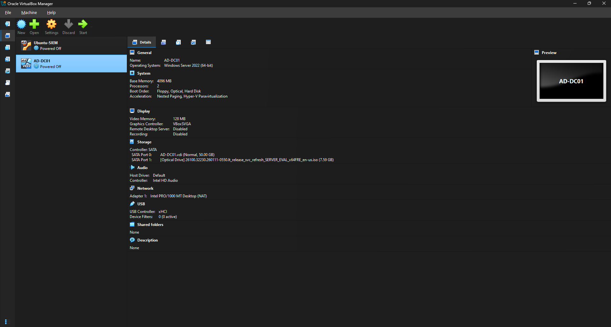

Windows Server 2025 Standard Evaluation with Desktop Experience was selected. Desktop Experience provides the graphical management tools used throughout the Active Directory configuration.

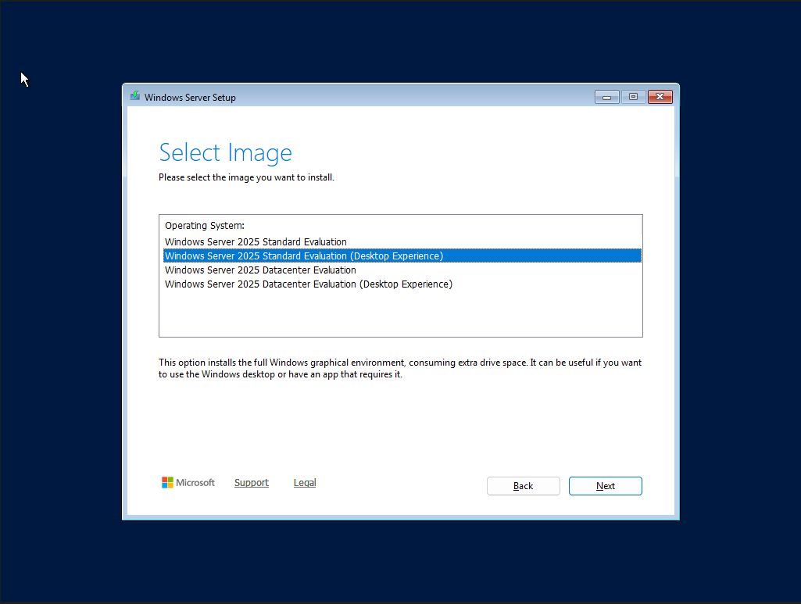

After installation, Server Manager was used to begin configuring the server.

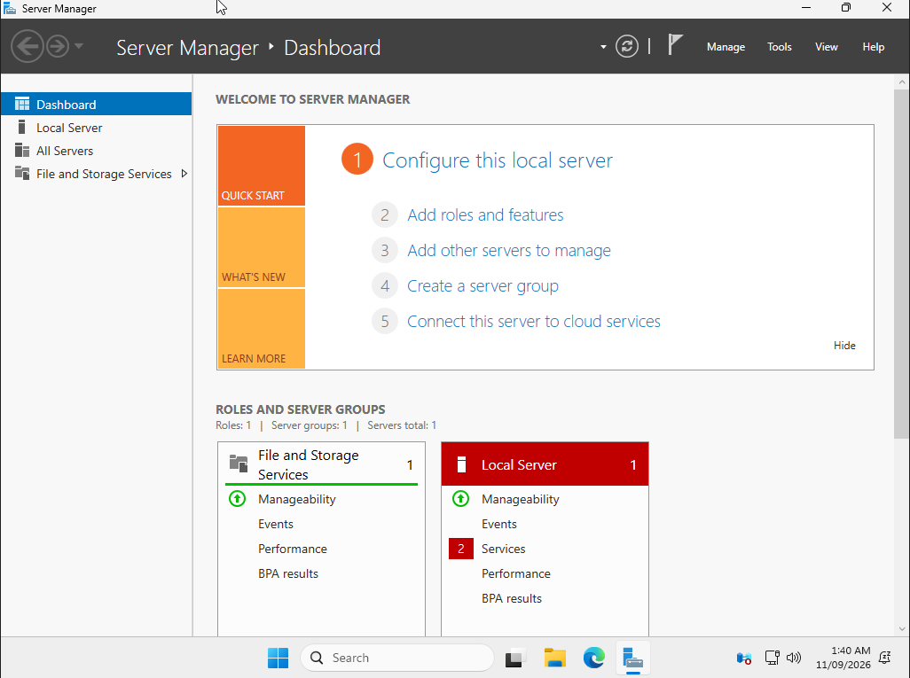

---

## 2. Static Network Configuration

Before installing Active Directory Domain Services, the server was assigned a static IPv4 address.

### Network Configuration

- IP address: `10.0.2.10`
- Subnet mask: `255.255.255.0`
- Default gateway: `10.0.2.2`
- Preferred DNS server: `10.0.2.10`

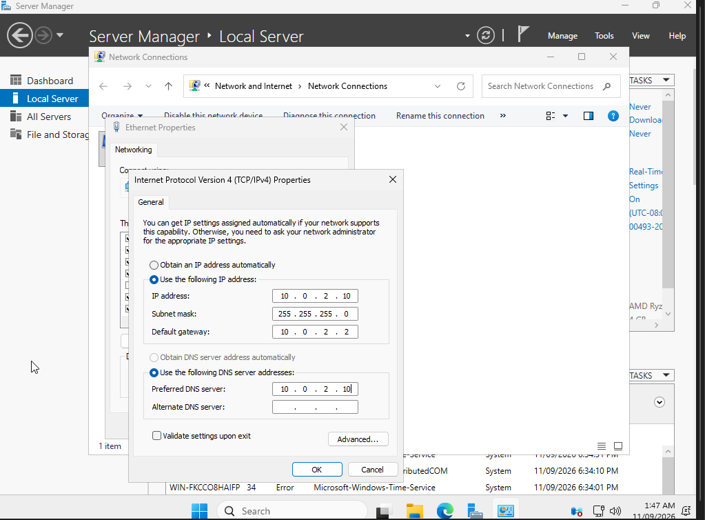

A static address is important for a domain controller because other domain systems need to reliably locate services such as Active Directory and DNS.

The server hostname was also changed to:

`AD-DC01`

After restarting the server, the hostname and network configuration were verified.

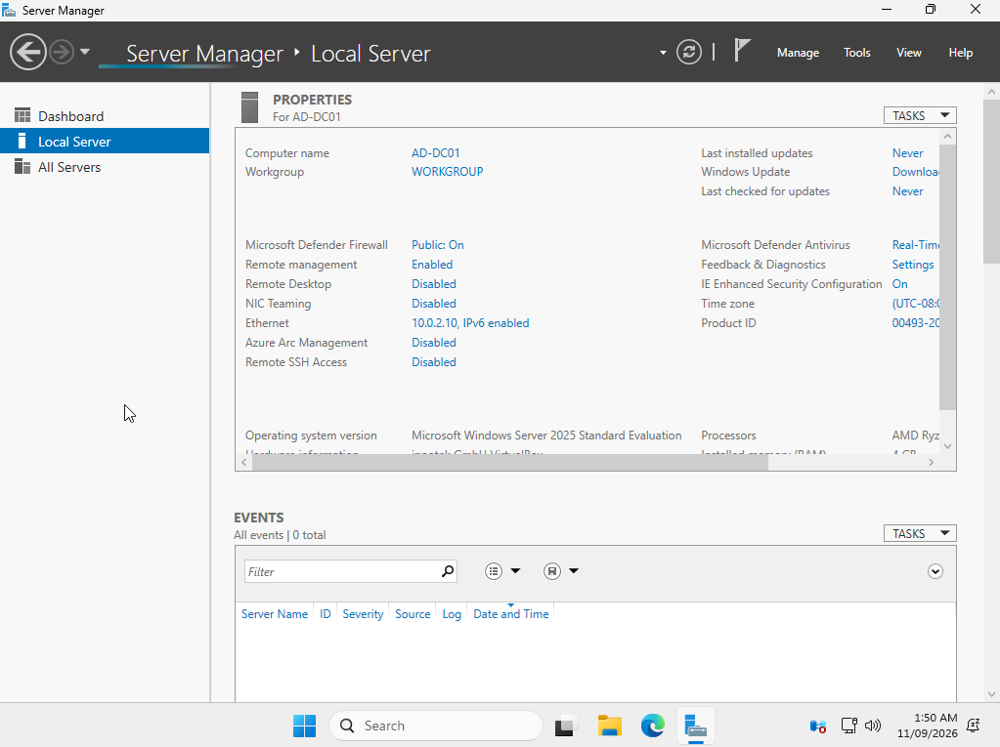

---

## 3. Installing Active Directory Domain Services

The Active Directory Domain Services role was added through Server Manager.

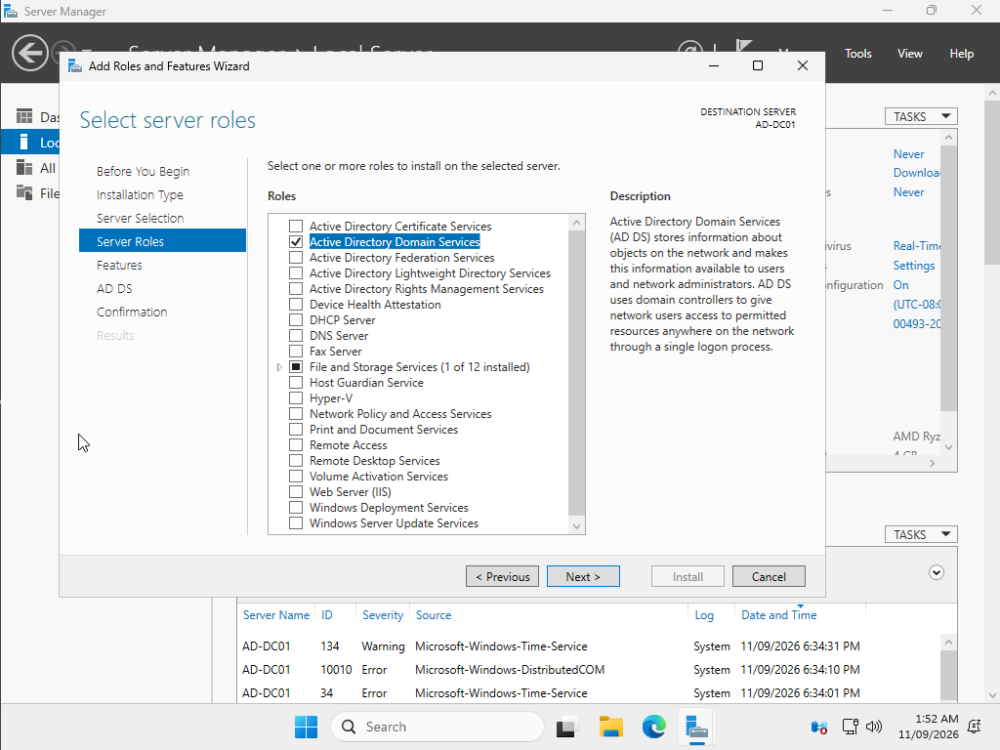

The installation included supporting management components such as Group Policy Management, Active Directory administration tools and the Active Directory PowerShell module.

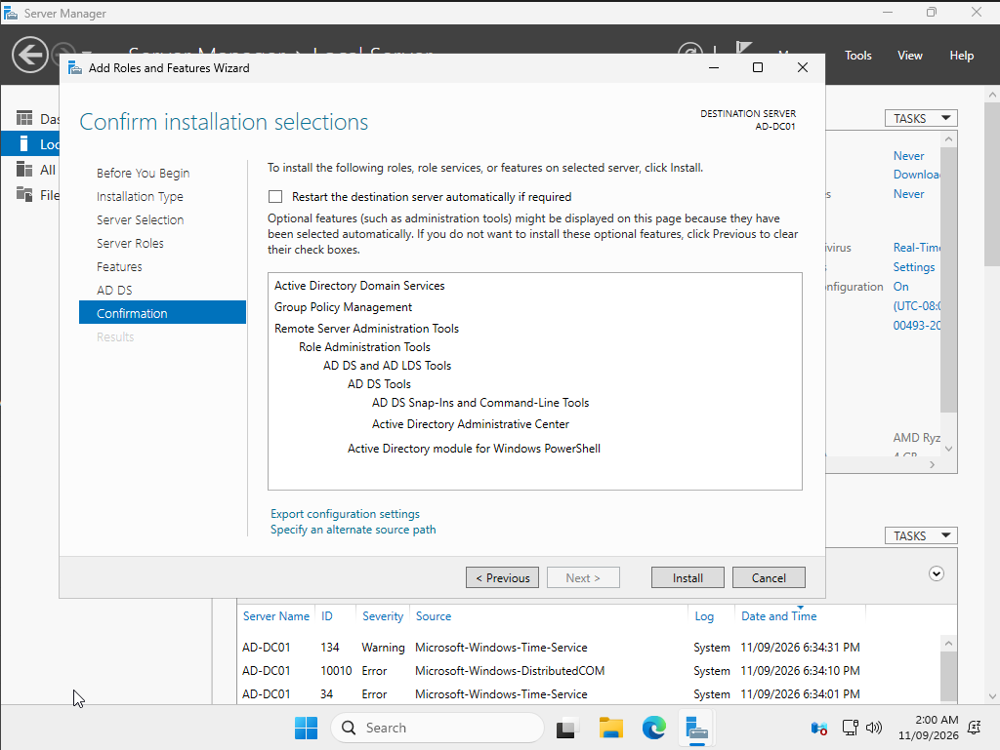

The AD DS role installed successfully.

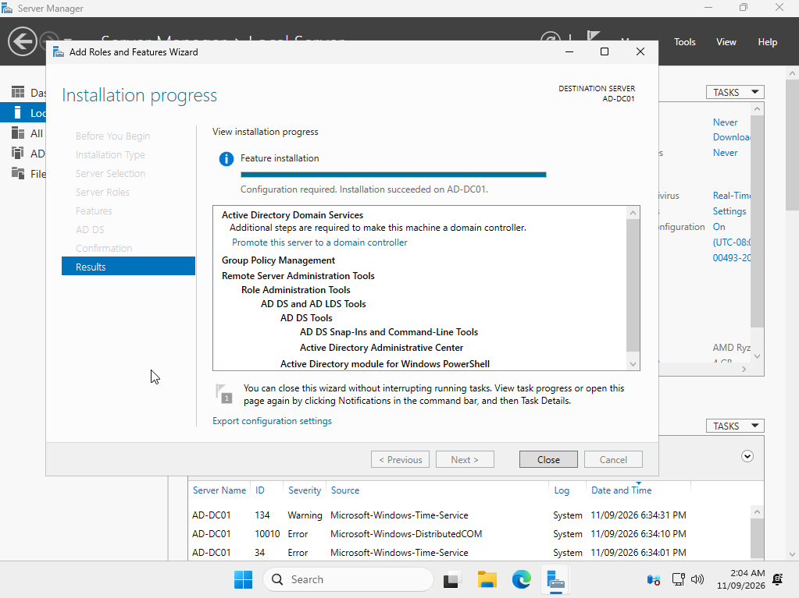

Installing AD DS alone does not make the server a domain controller. The server then needed to be promoted and an Active Directory forest created.

---

## 4. Creating the Active Directory Forest

Because this lab did not have an existing Active Directory environment, a new forest was created.

The root domain was configured as:

`soclab.local`

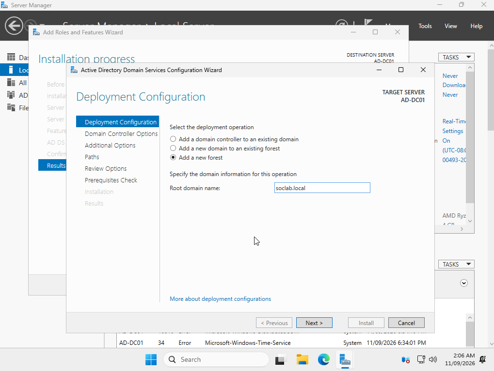

The resulting configuration included:

- Root domain: `soclab.local`
- NetBIOS domain: `SOCLAB`
- DNS Server: Enabled
- Global Catalog: Enabled
- Read Only Domain Controller: Disabled

The Directory Services Restore Mode password was configured during this process but is intentionally not documented in this repository.

Before promotion, the configuration was reviewed.

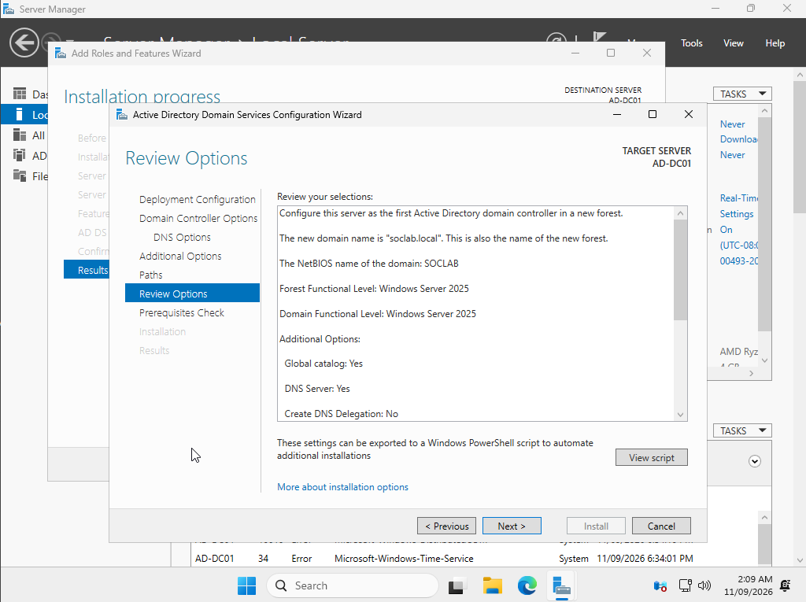

The Active Directory configuration wizard then performed prerequisite checks.

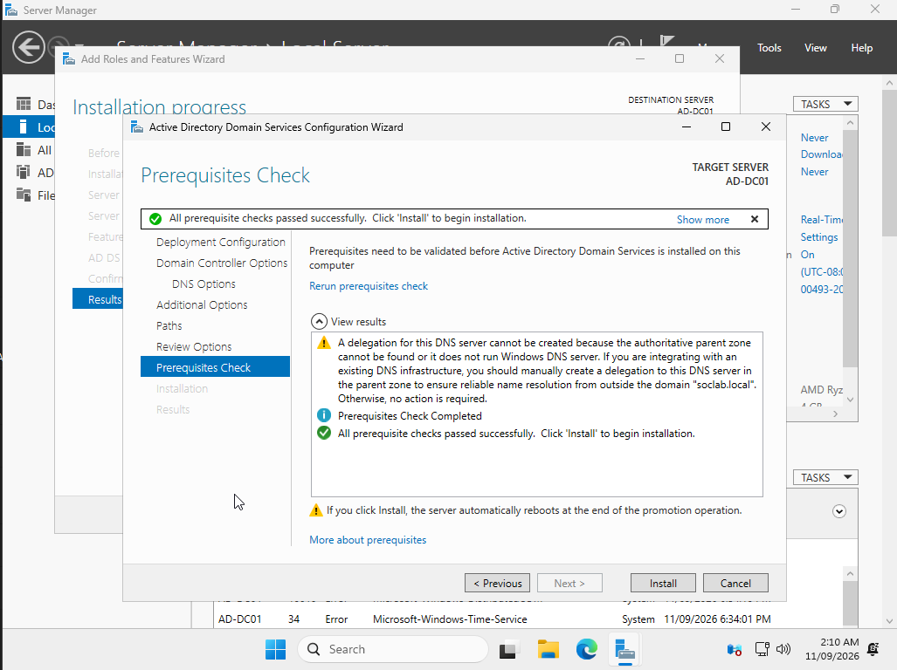

After all prerequisite checks passed, the server was promoted to a domain controller and restarted.

---

## 5. Domain Controller Verification

After promotion, Server Manager confirmed that `AD-DC01` belonged to the new `soclab.local` domain.

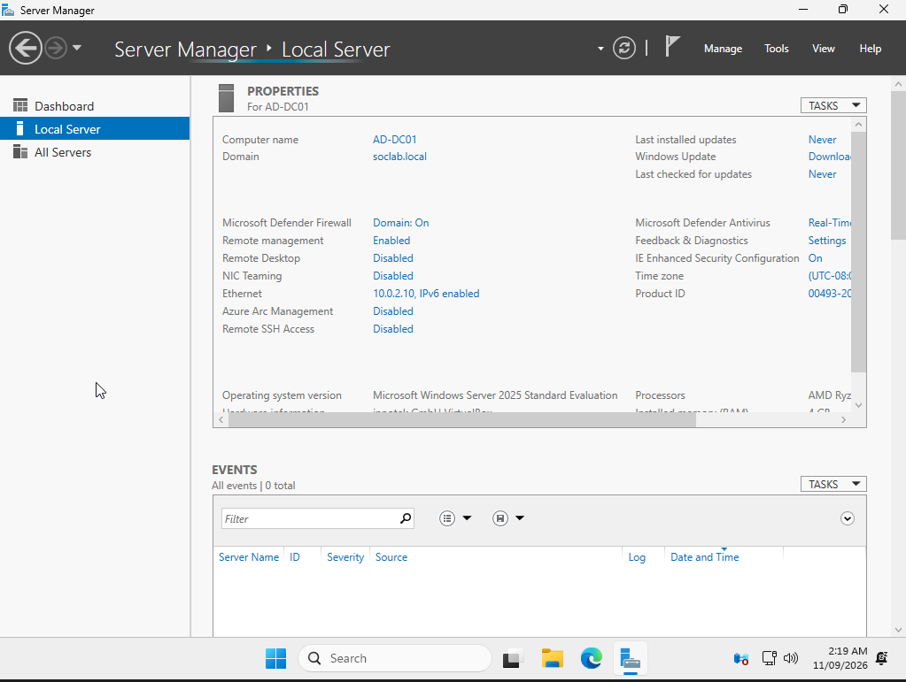

Active Directory Users and Computers was then used to confirm that `AD-DC01` appeared in the `Domain Controllers` container.

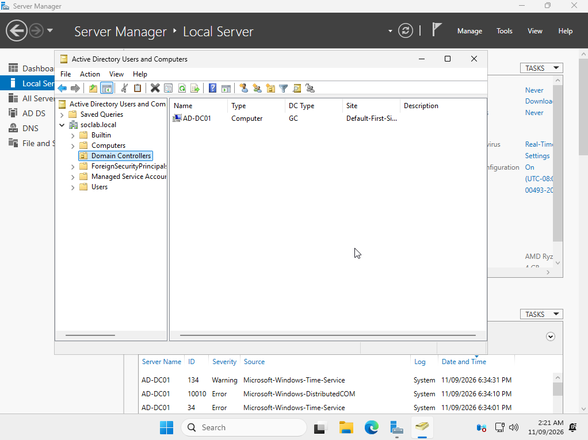

This confirmed that the new Active Directory forest and domain controller were operational.

---

## 6. Active Directory Organisational Structure

Rather than placing all lab objects in the default Active Directory containers, a dedicated organisational structure was created.

A top-level OU named:

`SOC-Lab`

was created with three child OUs:

- `Users`
- `Groups`
- `Workstations`

This provides logical separation between different types of Active Directory objects and will allow policies and configurations to be applied more easily later in the project.

Two fictional test users were created:

| Name | Username | Purpose |
| --- | --- | --- |
| Alex Morgan | `amorgan` | SOC analyst test account |
| Jordan Lee | `jlee` | Standard test user |


---

## 7. Security Group Configuration

A Global Security group named:

`SOC-Analysts`

was created inside the `Groups` OU.

The `amorgan` account was added to `SOC-Analysts`, while `jlee` remained a standard test user.


Using security groups rather than assigning permissions directly to individual users provides a more manageable way to control access as an environment grows.

---

## Current Active Directory Architecture

At this stage, the environment contains:

```text
soclab.local
│
├── Domain Controllers
│   └── AD-DC01
│
└── SOC-Lab
    ├── Users
    │   ├── Alex Morgan (amorgan)
    │   └── Jordan Lee (jlee)
    │
    ├── Groups
    │   └── SOC-Analysts
    │       └── amorgan
    │
    └── Workstations
```

The next stage of the project will introduce a Windows workstation that will be joined to `soclab.local`. This will provide a domain-connected endpoint from which authentication and other Windows security events can later be collected and analysed by the SIEM.
