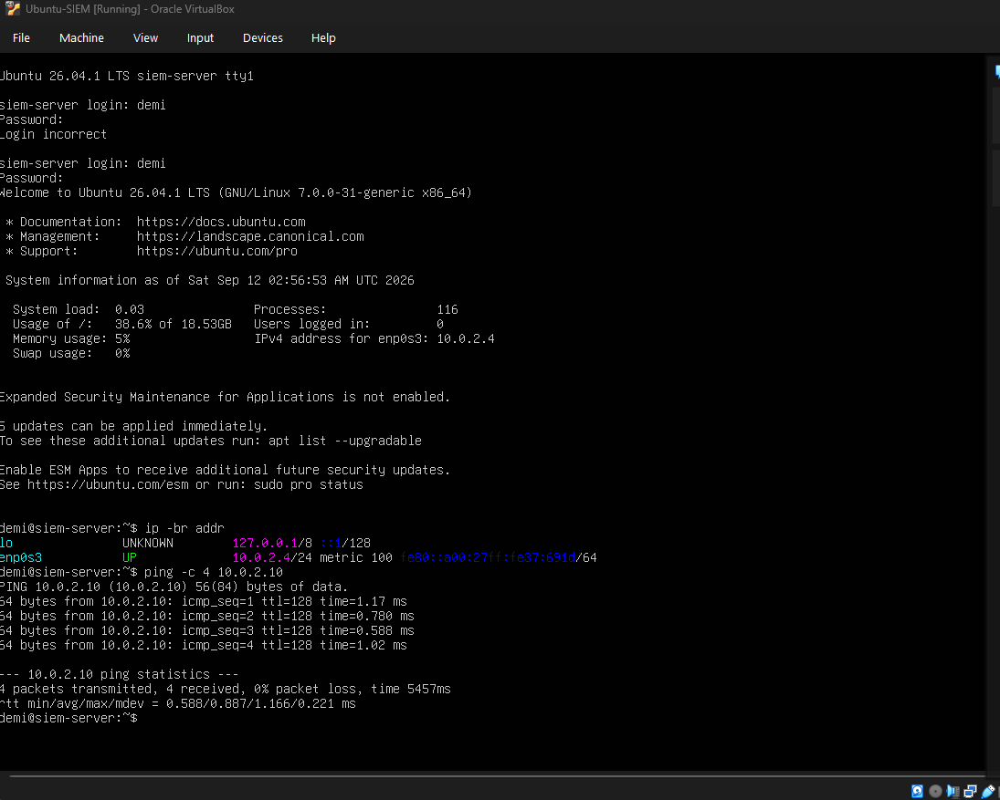
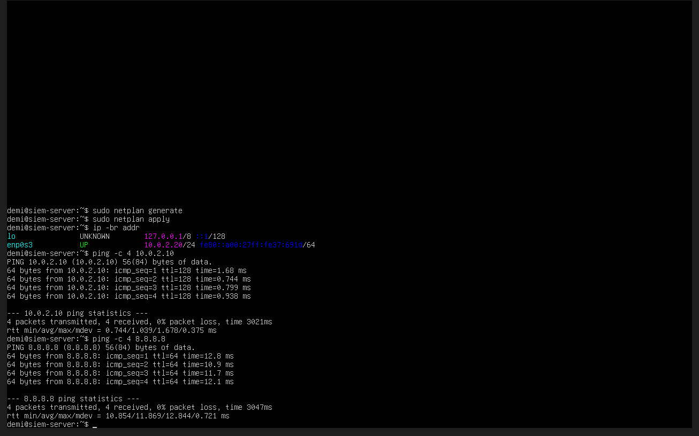
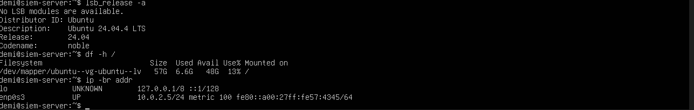
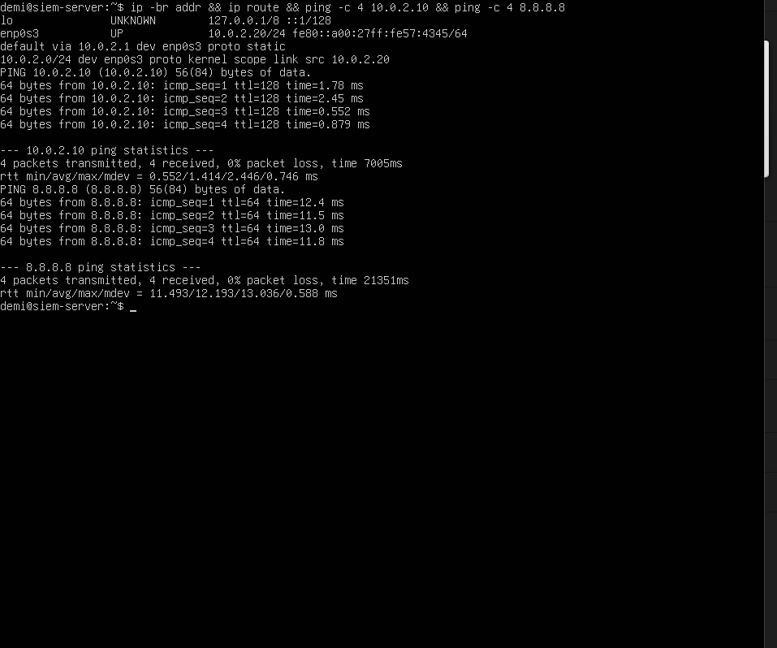
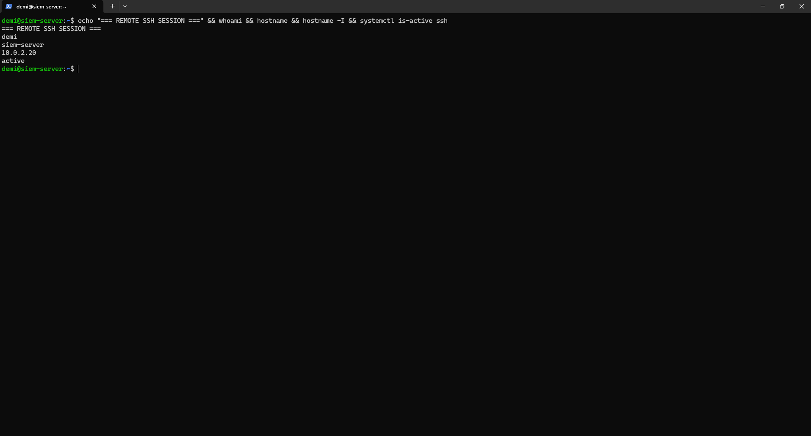

# Ubuntu SIEM Server Setup

## Overview

This system will act as the SIEM server for the SOC lab. It is connected to the same VirtualBox NAT Network as the Active Directory domain controller and Windows workstation.

The server will host Wazuh and receive security telemetry from systems within the lab.

## Initial Ubuntu Build

The SIEM server was initially deployed using Ubuntu Server 26.04.1 LTS with:

- 2 vCPUs
- 6 GB RAM
- 40 GB virtual disk
- VirtualBox NAT Network
- Hostname: `siem-server`
- OpenSSH Server

During the initial configuration, networking and remote administration were tested before deploying the SIEM platform.

### Storage Troubleshooting

Although the virtual disk was configured as 40 GB, the Ubuntu installer initially allocated only approximately 19 GB to the root logical volume.

The remaining LVM capacity was extended into the root filesystem using:

```bash
sudo lvextend -l +100%FREE -r /dev/ubuntu-vg/ubuntu-lv
```

This increased the usable root filesystem to approximately 38 GB.

## Network Configuration and Troubleshooting

The SIEM server requires a predictable address so other systems can reliably communicate with it.

The intended static address was:

- IP address: `10.0.2.20/24`
- DNS: `10.0.2.10` and `8.8.8.8`

An initial static configuration used `10.0.2.2` as the assumed default gateway.

Local communication with the Active Directory domain controller at `10.0.2.10` worked, but external connectivity failed.

To isolate the problem, the interface was temporarily returned to DHCP. The DHCP-supplied routing table showed that the VirtualBox NAT Network was actually using `10.0.2.1` as its default gateway.

The static configuration was then rebuilt using the verified gateway.

Final network configuration:

- Static IP: `10.0.2.20/24`
- Gateway: `10.0.2.1`
- Primary DNS: `10.0.2.10` (AD-DC01)
- Secondary DNS: `8.8.8.8`

Connectivity was verified to both the domain controller and the internet.





## Rebuilding the SIEM Server

Before installing Wazuh, the deployment requirements and supported operating systems were reviewed.

The original Ubuntu 26.04 server was replaced with Ubuntu Server 24.04 LTS to use a Wazuh-supported Ubuntu LTS release.

The VM resources were also increased before deploying the SIEM platform.

Final VM configuration:

- Ubuntu Server 24.04.4 LTS
- 4 vCPUs
- 8 GB RAM
- 60 GB dynamically allocated virtual disk
- Approximately 58 GB root logical volume
- Hostname: `siem-server`
- VirtualBox NAT Network

During installation, the root logical volume was manually configured to use the available LVM capacity rather than leaving a large portion of the volume group unused.



## Final Network Configuration

The rebuilt server was assigned the same infrastructure address:

`10.0.2.20/24`

with:

- Default gateway: `10.0.2.1`
- Primary DNS: `10.0.2.10`
- Secondary DNS: `8.8.8.8`

Testing confirmed:

- The interface was using `10.0.2.20/24`
- The default route used `10.0.2.1`
- AD-DC01 (`10.0.2.10`) was reachable
- External connectivity was working



## SSH Remote Administration

OpenSSH was enabled so the SIEM server could be administered remotely from the Windows host.

The SSH service was enabled at startup and verified as listening on TCP port 22.

Because the Ubuntu VM is located behind the VirtualBox NAT Network, a port-forwarding rule was used:

- Host: `127.0.0.1`
- Host port: `2222`
- Guest: `10.0.2.20`
- Guest port: `22`
- Protocol: TCP

The server can therefore be accessed from the Windows host using:

```powershell
ssh -p 2222 demi@127.0.0.1
```

Remote access was verified by confirming the remote username, hostname, server IP address and SSH service state.



## Current State

The Ubuntu SIEM host is now prepared for Wazuh deployment.

The server has:

- A supported Ubuntu LTS release
- Dedicated compute and storage resources
- Static networking
- Connectivity to the Active Directory environment
- Internet connectivity
- SSH remote administration

The next stage is to install Wazuh and begin collecting security telemetry from the Windows systems in the lab.
