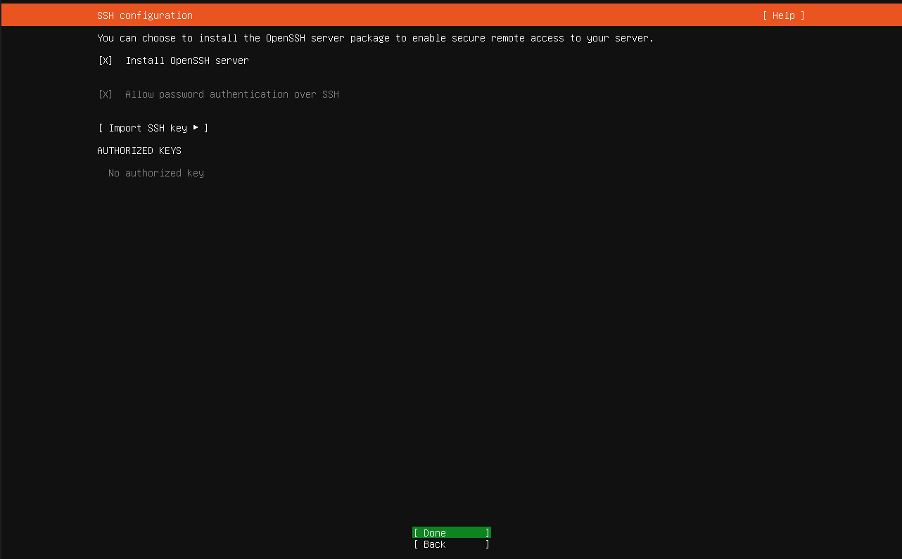
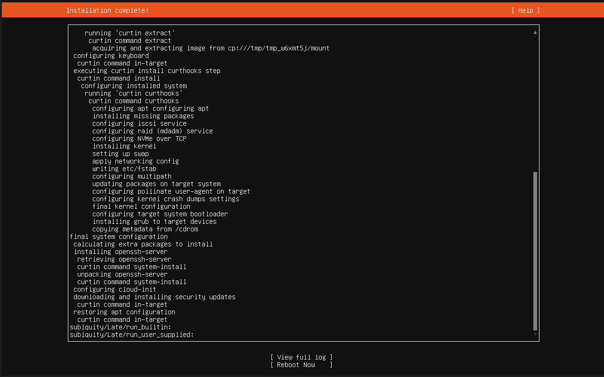

# Ubuntu SIEM Server Setup

## Purpose

This virtual machine will act as the Linux-based SIEM server for the SOC lab.

Ubuntu Server was selected because it is lightweight, suitable for server workloads, and allows more host resources to remain available for the Windows Server and Windows client virtual machines.

## Virtual Machine Configuration

The Ubuntu SIEM virtual machine was created in Oracle VirtualBox with the following configuration:

- VM name: `Ubuntu-SIEM`
- Operating system: Ubuntu Server 26.04.1 LTS
- Memory: 6144 MB
- Processors: 2
- Storage: 40 GB virtual disk
- Network adapter: NAT
- Hostname: `siem-server`


## Installation Configuration

During installation, the following choices were made:

- Default network configuration was used initially.
- No proxy server was configured.
- The default Ubuntu package mirror was used.
- OpenSSH Server was selected for installation.
- Password authentication over SSH was enabled.
- No additional featured server snaps were installed.

### OpenSSH Configuration

OpenSSH was enabled during installation so the server can later be managed remotely.



## Installation Completion

Ubuntu Server installed successfully.



## Post-Installation Verification

After the first boot, the following commands were used to verify the server:

```bash
hostname
lsb_release -a
ip -br addr
df -h /
systemctl is-active ssh
