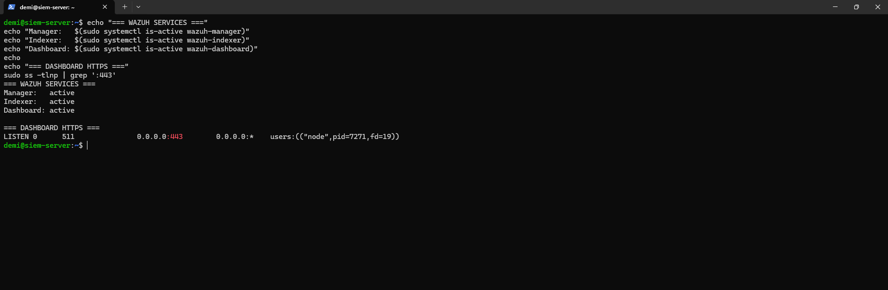
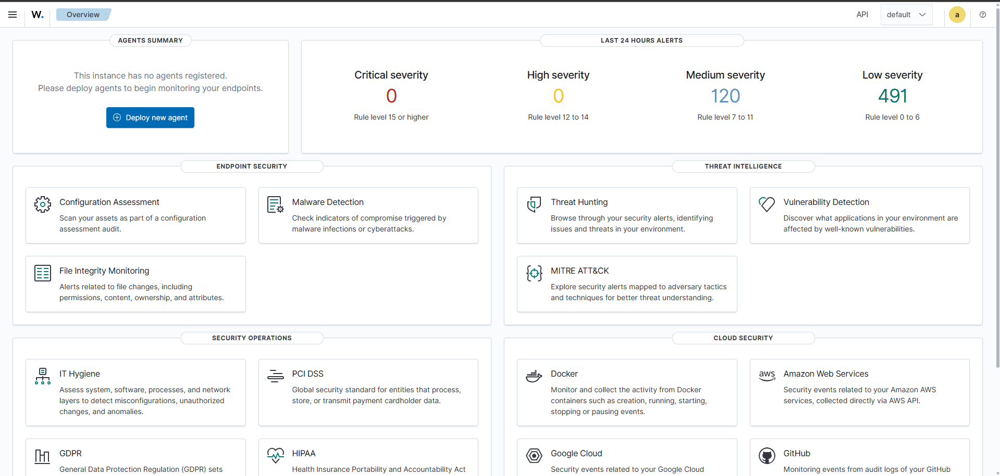

# Wazuh SIEM Deployment and Endpoint Monitoring

## Overview

Wazuh was deployed as the SIEM and endpoint monitoring platform for the SOC lab.

The central Wazuh components were installed on the Ubuntu SIEM server, while Wazuh agents were deployed to both Windows systems:

- `AD-DC01` — Windows Server 2025 Domain Controller
- `WIN-CLIENT01` — Windows 11 domain-joined workstation

This allowed security telemetry from both the server and workstation sides of the Active Directory environment to be collected and analysed centrally.

---

## Architecture

```text
AD-DC01 (Windows Server 2025)
Domain Controller + DNS
        │
        │ Wazuh Agent
        │
        └─────────────┐
                      │
                      ▼
                 Ubuntu-SIEM
                  10.0.2.20
                      │
              ┌───────┼───────┐
              │       │       │
           Manager  Indexer  Dashboard
                      ▲
                      │
        ┌─────────────┘
        │ Wazuh Agent
        │
WIN-CLIENT01 (Windows 11)
Domain Workstation
```

The three main Wazuh components used were:

- **Wazuh Manager** — receives and analyses security telemetry from monitored systems.
- **Wazuh Indexer** — stores and indexes security data so it can be searched and investigated.
- **Wazuh Dashboard** — provides the web interface used to view endpoints, alerts and security events.

---

## Wazuh Server

Wazuh 4.14 was deployed as an all-in-one installation on the Ubuntu SIEM server.

| Setting | Configuration |
|---|---|
| Operating System | Ubuntu Server 24.04 LTS |
| Hostname | `siem-server` |
| IP Address | `10.0.2.20` |
| CPU | 4 vCPU |
| Memory | 8 GB |
| Storage | 60 GB |
| Network | VirtualBox NAT Network |

The Wazuh Manager, Indexer and Dashboard were verified as active after deployment.



---

## Dashboard Access

The Wazuh Dashboard runs over HTTPS on port `443` of the Ubuntu SIEM server.

VirtualBox port forwarding was configured so the dashboard could be accessed from the physical host:

```text
127.0.0.1:8443
        ↓
VirtualBox Port Forwarding
        ↓
10.0.2.20:443
        ↓
Wazuh Dashboard
```

The working dashboard was then verified.



---

## Troubleshooting the Wazuh Deployment

Several issues occurred during deployment. Instead of repeatedly rebuilding the environment, each Wazuh component was checked individually to isolate the problem.

### Dashboard Package

The Wazuh Manager and Indexer were operational, but the Dashboard package had not completed installation correctly.

The Dashboard package was repaired separately rather than reinstalling the entire SIEM environment.

### Missing Dashboard Certificates

After repairing the package, the Dashboard still failed to start correctly.

Service logs showed that required TLS certificate files were missing. Certificates created during the original installation were located in the Wazuh installation archive and restored to the location expected by the Dashboard.

The Dashboard was restarted and HTTPS was verified as listening on port `443`.

### API Authentication

The Dashboard then became accessible, but communication between the Dashboard and Wazuh Manager failed because of an API credential mismatch.

The credentials were corrected and the Dashboard was restarted. The Wazuh Overview subsequently loaded successfully.

### Troubleshooting Approach

The general troubleshooting process was:

```text
Check component status
        ↓
Isolate affected component
        ↓
Inspect logs
        ↓
Identify specific error
        ↓
Apply targeted fix
        ↓
Restart service
        ↓
Verify functionality
```

---

## Endpoint Monitoring

Wazuh agents were installed on both Windows systems and configured to communicate with the Wazuh Manager at `10.0.2.20`.

| Endpoint | Role | Operating System |
|---|---|---|
| `WIN-CLIENT01` | Domain workstation | Windows 11 Pro |
| `AD-DC01` | Domain Controller / DNS server | Windows Server 2025 |

Both agents successfully registered and displayed as **Active** in Wazuh.


---

## Detection Test 1 — Failed Domain Authentication

A controlled authentication failure was generated on `WIN-CLIENT01`.

While logged in as `SOCLAB\amorgan`, an authentication attempt was made using the lab account `SOCLAB\jlee` with an intentionally incorrect lab password.

Windows generated:

```text
Security Event ID: 4625
```

Wazuh collected the event and classified it as:

```text
Logon Failure - Unknown user or bad password
```

Investigation of the event showed:

```text
Agent:          WIN-CLIENT01
Domain:         SOCLAB
Target account: jlee
Event ID:       4625
Wazuh Rule:     60122
Rule Level:     5
```


This demonstrated:

```text
Authentication failure
        ↓
Windows Security log
        ↓
Wazuh Agent
        ↓
Wazuh Manager
        ↓
Detection
        ↓
Threat Hunting investigation
```

---

## Detection Test 2 — Active Directory Group Change

A second controlled test was performed on `AD-DC01`.

The membership of the lab security group `SOC-Analysts` was temporarily modified using Active Directory Users and Computers.

The Domain Controller recorded the security-related change and Wazuh collected the event.

Investigation showed:

```text
Agent:      AD-DC01
Computer:   AD-DC01.soclab.local
Actor:      Administrator
Domain:     SOCLAB
Target:     SOC-Analysts
Event ID:   4737
Channel:    Security
```


The temporary group membership change was reverted after testing.

This demonstrated security monitoring of Active Directory activity occurring directly on the Domain Controller.

---

## What I Learned

This stage provided practical experience with:

- Deploying a SIEM in a virtual environment
- Understanding the Wazuh Manager, Indexer and Dashboard
- Installing and managing endpoint agents
- Monitoring Windows workstations and servers
- Working with Windows Security events
- Investigating authentication failures
- Monitoring Active Directory security activity
- Using Wazuh Threat Hunting
- Troubleshooting Linux services and logs
- Troubleshooting API authentication
- Working with HTTPS certificates

An important troubleshooting lesson was that a service being active does not necessarily mean the complete application is functioning correctly.

The Wazuh deployment required checking several layers independently:

```text
Service running
      ↓
Port listening
      ↓
HTTPS functioning
      ↓
API reachable
      ↓
Authentication working
      ↓
Application functioning
```

---

## Result

The completed SOC lab now contains:

- Active Directory domain `soclab.local`
- Windows Server Domain Controller
- Domain-joined Windows 11 workstation
- Centralised DNS
- Ubuntu SIEM server
- Wazuh endpoint monitoring
- Central security-event collection
- Threat Hunting and event investigation
- Controlled detection testing on both monitored Windows systems

The environment successfully demonstrated security monitoring from event generation through to centralised investigation.
