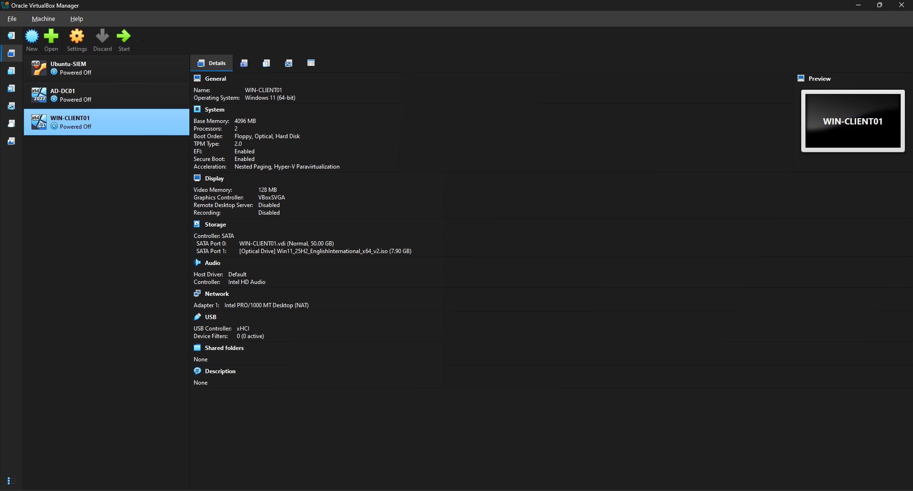
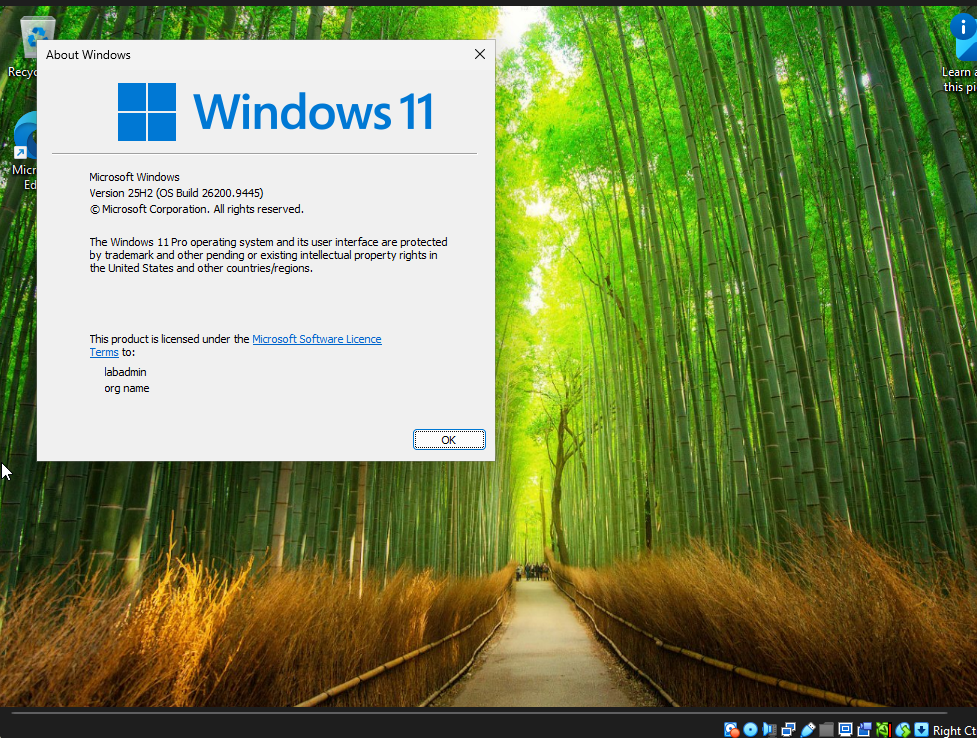
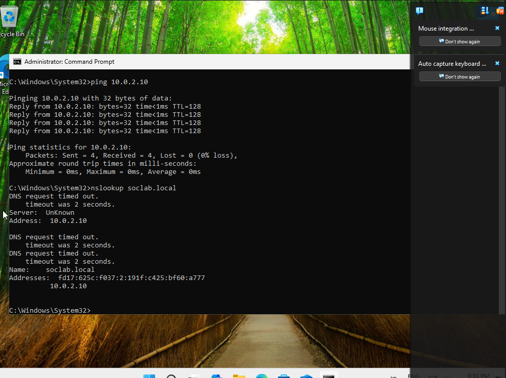
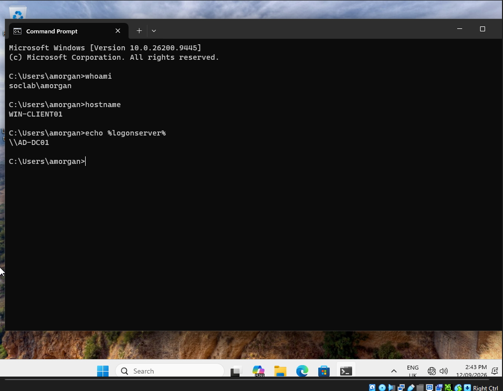
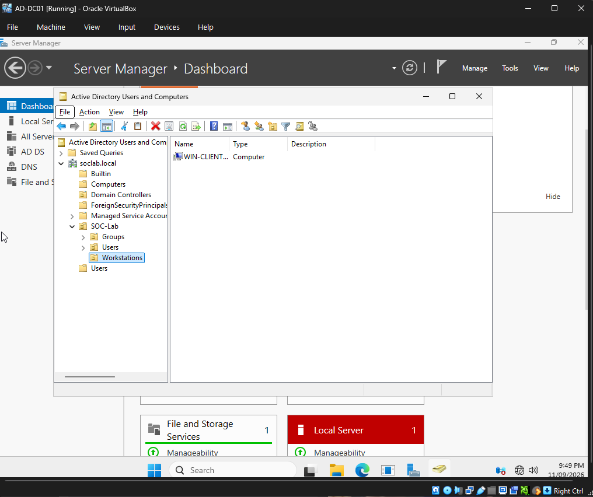

# Windows 11 Domain Workstation Setup

## Overview

A Windows 11 Pro virtual machine named `WIN-CLIENT01` was deployed as the first domain-connected workstation in the SOC lab.

The purpose of this system is to act as a realistic Windows endpoint inside the `soclab.local` Active Directory environment. It will later generate authentication and security events that can be collected and analysed by the SIEM.

---

## 1. Windows 11 Virtual Machine

A new Windows 11 virtual machine was created in Oracle VirtualBox.

### VM Configuration

- Name: `WIN-CLIENT01`
- Operating System: Windows 11 Pro
- Memory: 4096 MB
- Processors: 2
- Storage: 50 GB
- Network: NAT initially
- TPM 2.0: Enabled
- Secure Boot: Enabled



Windows 11 Pro was used because it supports joining a traditional Active Directory domain.

---

## 2. Windows 11 Installation Verification

After installation, the operating system edition was verified using `winver`.



This confirmed that `WIN-CLIENT01` was running Windows 11 Pro and was suitable for domain integration.

---

## 3. DNS and Network Configuration

For a workstation to join an Active Directory domain, it must be able to locate the domain controller and the domain's DNS services.

The DNS server on `WIN-CLIENT01` was therefore configured to use:

`10.0.2.10`

This is the static IPv4 address assigned to `AD-DC01`.

The workstation continued to receive its own IPv4 address through DHCP.

---

## 4. VirtualBox Network Troubleshooting

Initially, both `AD-DC01` and `WIN-CLIENT01` were configured using separate VirtualBox NAT adapters.

Although each virtual machine had internet connectivity, `WIN-CLIENT01` was unable to communicate correctly with the domain controller.

This prevented reliable domain discovery.

To resolve the issue, the Windows systems were moved onto the same VirtualBox NAT Network.

This allowed the virtual machines to communicate directly while still retaining internet connectivity.

After correcting the network configuration, connectivity was tested using:

```cmd
ping 10.0.2.10
nslookup soclab.local
```

The workstation successfully reached the domain controller and resolved `soclab.local` through the DNS server at `10.0.2.10`.



This troubleshooting step demonstrated the importance of both DNS and underlying network connectivity in Active Directory environments.

---

## 5. Joining the Active Directory Domain

Once DNS and network connectivity were working, `WIN-CLIENT01` was joined to:

`soclab.local`

Domain Administrator credentials were used to authorise the workstation to join the Active Directory environment.

After the domain join completed, the workstation was restarted.

---

## 6. Domain User Authentication

After restarting, the workstation was accessed using the domain account:

`amorgan@soclab.local`

This account had previously been created in Active Directory on `AD-DC01`.

The domain login was verified using:

```cmd
whoami
hostname
echo %logonserver%
```

The output confirmed:

```text
soclab\amorgan
WIN-CLIENT01
\\AD-DC01
```



This verifies that:

- `amorgan` authenticated as a domain user
- the login occurred on `WIN-CLIENT01`
- `AD-DC01` acted as the logon server

This is an important milestone because authentication is now occurring across separate systems through Active Directory rather than through local-only Windows accounts.

---

## 7. Active Directory Workstation Organisation

When `WIN-CLIENT01` joined the domain, Active Directory automatically created a computer object for the workstation.

The computer object was then moved into:

`SOC-Lab → Workstations`



This keeps workstation objects separated from users and groups and prepares the environment for future Group Policy and security configuration.

---

## Current Lab Architecture

The lab currently contains three primary systems:

```text
                soclab.local
                     │
                     │
              ┌──────▼──────┐
              │   AD-DC01   │
              │ Win Server  │
              │ AD DS / DNS │
              └──────┬──────┘
                     │
              Domain authentication
                     │
              ┌──────▼─────────┐
              │ WIN-CLIENT01   │
              │ Windows 11 Pro │
              │ Domain Client  │
              └────────────────┘


              ┌────────────────┐
              │  Ubuntu-SIEM   │
              │ Ubuntu Server  │
              │ Future SIEM    │
              └────────────────┘
```

At this stage, the Active Directory environment is operational and contains a domain controller, domain identities, security groups and a domain-connected Windows workstation.

The next stage of the project is to deploy and configure the SIEM on `Ubuntu-SIEM`, connect the Windows systems to it, and begin collecting and analysing Windows security events.
